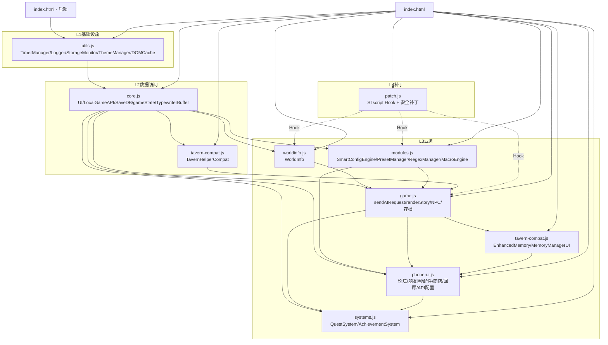

# 02 · 整体架构

## 2.1 分层架构

整个前端采用 **「类 MVC + 分层」** 结构，从下到上分为 5 层：

```
┌───────────────────────────────────────────────────────────────────┐
│  L5  视图层  (HTML 模板 + CSS + 各页面 renderXxx() 渲染器)        │
├───────────────────────────────────────────────────────────────────┤
│  L4  表现层  (UI.toast / showPage / TypewriterBuffer / 模态框)    │
├───────────────────────────────────────────────────────────────────┤
│  L3  业务层  (gameState 业务方法、EnhancedMemory、QuestSystem、    │
│              AchievementSystem、PresetManager、WorldInfo、        │
│              NPC 系统、存档系统、记忆管理)                         │
├───────────────────────────────────────────────────────────────────┤
│  L2  AI/数据访问层  (callAI、sendAIRequest、parseAIResponse、     │
│                       LocalGameAPI、SaveDB、TavernHelperCompat)   │
├───────────────────────────────────────────────────────────────────┤
│  L1  基础设施层  (DOMCache、Logger、TimerManager、StorageMonitor、│
│                   ThemeManager、StorageMonitor、GlobalCleanup)    │
└───────────────────────────────────────────────────────────────────┘
```

### 各层文件归属

| 层 | 主要文件 |
| --- | --- |
| L1 基础设施 | `js/utils.js` |
| L2 数据访问 | `js/core.js`（LocalGameAPI、SaveDB）、`js/tavern-compat.js`（TavernHelperCompat）、`cloudflare-worker-proxy.js` |
| L3 业务 | `js/core.js`（gameState、buildSystemPrompt）、`js/worldinfo.js`、`js/modules.js`、`js/game.js`、`js/phone-ui.js`、`js/systems.js`、`js/tavern-compat.js`（EnhancedMemory、MemoryManagerUI） |
| L4 表现 | `js/core.js`（UI、TypewriterBuffer、showStoryLoading…）、`js/game.js`（renderStory、formatStory） |
| L5 视图 | `index.html`、`css/*.css`、各 `renderXxxPage()` |

## 2.2 模块依赖图



> **强约束**：所有脚本都用「`var X = {...}` 全局对象」风格，必须保证被依赖者先加载。`init.js` 处于最后，在所有全局对象就绪后才执行 `initApp()`。

## 2.3 初始化与启动序列

```
[HTML 解析完成]
    │
    ▼
[utils.js 同步执行]  (在 <head> 提前加载)
    │  - 注册 window.beforeunload → GlobalCleanup
    │  - 立即应用主题（避免 FOUC）
    ▼
[HTML body 解析完，依次加载 core/worldinfo/modules/game/phone-ui/systems/tavern-compat]
    ▼
[init.js 末尾]
    │  - if (document.readyState === 'loading') DOMContentLoaded
    │  - else initApp()
    ▼
[initApp()]
    │
    ├─ ThemeManager.init()       (深/浅色 + 系统偏好监听)
    ├─ WorldInfo.init()          (load + bindEvents)
    ├─ PresetManager.init()      (load + loadCurrentParams + bindEvents)
    ├─ RegexManager.init()       (load + _loadAllowedList + bindEvents)
    ├─ MacroEngine.init()        (loadGlobal 变量)
    ├─ SaveDB.init() / migrate() (异步, IndexedDB → fallback localStorage)
    ├─ loadGameSettings()
    ├─ PresetManager.updateSetupPresetDisplay()
    ├─ LocalGameAPI.init()
    ├─ renderMenu()
    ├─ bindEvents()
    └─ TavernHelperCompat.emit('APP_READY')
    ▼
[patch.js 启动]
    │
    ├─ STscript 集成（Hook PresetManager.loadPreset / injectPresetGlobalVars / RegexManager.applyToOutput 等）
    └─ 安全补丁 v3.0（TimerManager / StateUtils / debounce / throttle 兜底）
```

> `patch.js` 设计为「加载在最后的安全补丁」，**不修改任何原代码**，只通过对象引用替换（monkey-patch）方式注入新行为。详见 [03 § patch.js](./03-modules.md#patch-js)。

## 2.4 一回合 AI 交互的数据流

下图是 **「玩家点击选项 → AI 返回 → 渲染到屏幕」** 的完整链路：

```
玩家操作（点击选项 / 输入 customAction）
    │
    ▼
sendAIRequest(userMessage, isInit=false)            [game.js]
    │
    ├─ isWaiting 保护
    ├─ safeAbort() 取消上一次请求
    ├─ setWaiting(true) / showStoryLoading()
    ├─ RegexManager.applyToInput(userMessage)        ← 正则预处理用户输入
    ├─ TavernHelperCompat.emit('USER_MESSAGE_RENDERED')
    ├─ injectPresetGlobalVars()                      ← 注入 {{getglobalvar::XXX}} 变量
    │
    ▼
构建 messages 列表（按 SillyTavern 标准顺序）:
    [0] system (gameState.systemPrompt, 含预设 prompt + 记忆 + 世界书)
    [1..n] history (从 conversationHistory.slice(1) 取 -MAX_HISTORY)
    [n+1] depth prompts (世界书 depth 注入)
    [n+2] user (本轮)
    [n+3] jb/assistant prompts
    [n+4] afterChat prompts
    │
    ▼
callAI(messages, {stream: true})                    [core.js]
    │
    ▼
LocalGameAPI.tryWithFallback(async (slot) => ...)   [core.js]
    │
    ├─ 选槽（轮询 / 失败列表）
    ├─ POST {baseUrl}/chat/completions (stream=true)
    ├─ fetch + AbortController.signal
    │
    ▼ 流式 SSE
    for each chunk:
        onStreamChunk(chunk)                         [game.js]
            ├─ extractStoryStreaming(streamBuffer)   ← 状态机提取 "story" 字段
            ├─ RegexManager.applyToOutput(story)     ← 边流边应用输出正则
            └─ TypewriterBuffer.push(story)          ← 段落级节流 + 标点停顿
    │
    ▼ 完成后
parseAIResponse(rawReply)                            [core.js]
    │
    ├─ safeJSONParse → ```json 提取 → robustParse 状态机兜底
    ├─ 提取 story / hud / choices / player / characters / world / bag / quests /
    │     relationships / keyEvents / npcMessages / currency / contextSummary
    ├─ GameTimeSystem.parseFromAI(data)              ← 时间字段解析
    ├─ PresetAppManager.parseFromText(story)        ← 解析装饰 XML 标签
    ├─ mergeCharacters / mergeQuests / mergeRelationships  ← 增量合并
    └─ _parseStructuredSummary + _extractAndStoreImportantInfo  ← 桥接 EnhancedMemory
    │
    ▼
renderStory(text)  → formatStory → sanitizeHtml → DOM 写入
renderHUD(hud) / renderChoices(choices) / renderPlayerPage() / renderNpcPage()
PresetAppManager 写入 gameState._presetApps
EnhancedMemory.processMessage()  ← 三层记忆
QuestSystem / AchievementSystem 自动检查
autoSave()  (2 秒防抖)
    │
    ▼
TypewriterBuffer 持续把字符推进 #storyText，配合标点停顿、段落节流
```

## 2.5 全局状态模型

整个应用共享 **一个 `gameState` 单例**（`core.js`），由 `createDefaultGameState()` 工厂创建：

```js
gameState = {
  _version: '1.2.0',
  userPrompt, customStyle, systemPrompt,         // 玩家/AI 输入
  conversationHistory: [...],                     // [{role, content}]
  allCharacters: { name: {details, favorability, ...} },
  temperature, fontSize, pinnedModules,           // 偏好
  rollingSummary, autoCompress, tokenCount, maxTokens,
  useStream, streamFailCount, generateChoices,
  keyEvents: [...],                               // AI 返回的关键事件
  worldSnapshot: {},                              // 长期世界观
  currentQuests: [...],                           // 任务（与 QuestSystem 互通）
  relationships: [...],                           // 关系网
  currentBag: [...],                              // 背包
  playerData: null,                               // 主角快照
  favStories: [...], generatedNovel: '',
  protagonistSetup: { mcName, mcGender, ... },    // 主角 8 字段
  gameTime: { date, time, period, weather, era }, // AI 时间系统
  _presetApps: {},                                // 预设动态 app 内容
  _stats: { startTime, totalTurns, totalTokens, ... },
  _undoHistory: [], _MAX_UNDO_HISTORY: 50,        // 撤销栈
  wordCountConfig: { enabled, min, max, ... },
  _theaterContent, _worldModules, _chatLogs, _chattedNpcs,
  _lastAIReply, _depthPrompts, _positionPrompts,
  _afterChatPrompts, _wiCachedResult, _moments, _npcDiaries, _mail, _diary
}
```

并伴随 **4 个游离单例**：

| 名称 | 位置 | 作用 |
| --- | --- | --- |
| `streamBuffer` | `core.js` | 流式 chunk 累积缓冲 |
| `isWaiting` | `core.js` | 全局等待锁 |
| `TypewriterBuffer` | `core.js` | 打字机队列 + 段落节流 |
| `npcChatState` | `core.js` | NPC 私聊独立状态机 |
| `GameTimeSystem` | `core.js` | 时间字段解析与 UI 刷新 |
| `gameAdapter` | `patch.js` | STscript 引擎适配器（运行时由 `gameAdapter.js` 注入窗口） |

## 2.6 关键设计模式

| 模式 | 体现 |
| --- | --- |
| **单例 + 工厂** | `createDefaultGameState()` 统一初始化字段 |
| **状态机容错** | `safeJSONParse` / `robustParse` / `extractStoryStreaming` |
| **管线 (Pipeline)** | `onStreamChunk → extractStory → RegexManager → TypewriterBuffer` |
| **对象池 / 缓存** | `DOMCache`（30 s TTL）、`_wiCachedResult`（单次请求内复用） |
| **事件总线** | `TavernHelperCompat.emit/on`（APP_READY、USER_MESSAGE_RENDERED、MESSAGE_RECEIVED…） |
| **Monorepo 安全补丁** | `patch.js` 只追加不修改原始对象方法 |
| **乐观锁** | `isWaiting`、`saveUndoState()` 撤销栈、`_autoSaveTimer` 防抖 |
| **桥接 (Bridge)** | `parseAIResponse` 把预设输出桥接到游戏原生系统（QuestSystem/EnhancedMemory/PresetAppManager/…） |
| **Lorebook 注入** | `WorldInfo.buildInjection()` 按 SillyTavern 标准在 depth/position 注入 |

## 2.7 渲染机制

* **页面切换**：`UI.showPage(id)` 切 `.active` class，HTML 中 10 个 `<div class="page">` 互斥显示。
* **页面内渲染**：每个页面用 `renderXxxPage()` 函数按需填充 DOM；导航条由 `renderNavBar(containerId, tabs, activeIndex)` 统一渲染。
* **流式渲染**：`TypewriterBuffer` 维护 `queue` + `displayed`，每帧 `requestAnimationFrame` 渲染一段；按标点（。！？，、…）智能停顿。
* **装饰组件**：`PresetAppManager.parseFromText` 抽取 `<snow>、<ice>、<meow_FM>、<branches>、<giggle>…` 等标签到 `gameState._presetApps`，主菜单底部出现对应入口。

## 2.8 兼容层架构

`tavern-compat.js` 充当「SillyTavern 兼容适配层」，对外提供：

```
TavernHelperCompat
├── getContext()                  // 模拟 ST 的 chat / character / group
├── registerSlashCommand()        // /run 指令
├── triggerSlash()                // 调用 /xxxx
├── toast / toastr.success 等
├── Quick Reply API               // 模拟酒馆 QR 脚本
├── setVariable / getVariable     // 全局变量
├── eventOn / eventOff / emit     // 事件总线
└── presets / scripts             // QR 脚本存储

EnhancedMemory                    // 替代 ST 的 Summary 插件
└── 三层记忆 + 自动压缩 + 摘要版本

MemoryManagerUI                   // 替代 ST 的 Memory Manager 扩展
└── 总览/时间线/角色/物品/地点/事件/世界/搜索
```

`patch.js` 又在之上叠加一层 **STscript Hook**，让游戏运行时同时支持：

* **果实·叶子版 3.0**
* **月读·Gemini v1.2**
* **蛾摩拉☼ 2.4**

这三种主流预设的正则与 STscript 语法。

> 详见 [03 § tavern-compat.js / patch.js](./03-modules.md#tavern-compat-js)。
